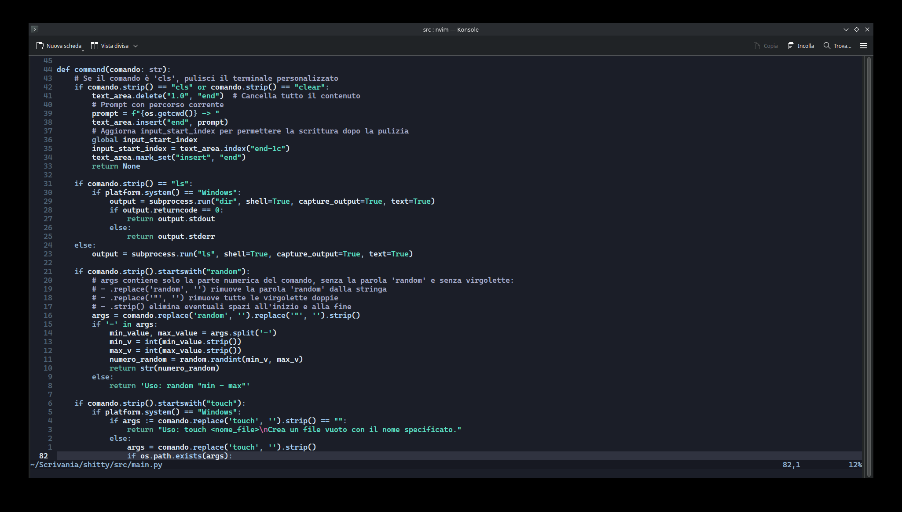

# Neovim Config

Questa è la mia configurazione per **Neovim** gestita con il plugin manager **Packer**.



## Come installare

1. Clona questa configurazione nella cartella di Neovim:

```bash
git clone https://github.com/USERNAME/nvim-config.git ~/.config/nvim
```

2. Avvia Neovim e Packer installerà automaticamente tutti i plugin configurati.
